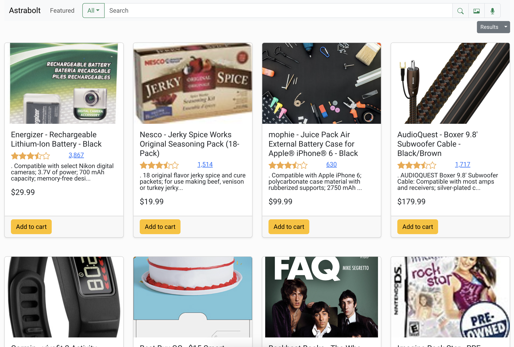
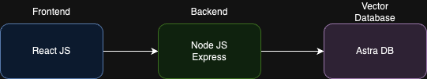

# Astrabolt Demo

This is a demo of fictitious e-commerce site based on [BestBuy's Open Data Set](https://github.com/BestBuyAPIs/open-data-set) product catalog. It showcases how **Astra DB's vector search** capabilities can be utilized to power Generative AI experiences for an e-commerce use case.

It uses the latest`@datastax/astra-db-ts` SDK, and it integrates transparently with `langchain` and Google's `multimodalmultimodalembedding@001` (Gemini) to power semantic search via voice, text, or images.

## Use Cases Showcased
- **Product Catalog**: The entire product catalog is stored on Astra DB, and its used not only for semantic search but also for retrieving the product catalog. It suppors filtering based on any product attribute, as well as modifying the number of results.
- **Featured Products**: This uses historical user queries to do semantic search of similar products in the product catalog. Those are presented to the user under the Featured page. Currently this uses a list of strings that can be customized by modifying the file `astrabolt-frontend-js/src/data/previousSearches.json`. In the future this can be changed to actual user queries stored in the DB, or additional data points from user's behavior.
- **Search**: The search input allows the user to use text, an image, or voice as the input for the query. This query is then vectorized using Google's Gemini, and used for Semantic Search via **langchain** and [AstraDBVectorStore](https://js.langchain.com/docs/integrations/vectorstores/astradb).

## Getting Started

The application uses [Astra DB](https://www.datastax.com/products/datastax-astra) as the Vector Store, and it has a frontend built in React JS, and a backend built in express. Here's a simplified architecture diagram for your reference.

Follow these steps to get started with this demo.

1. Run through the [Astrabolt - Load Products Notebook](notebooks/Astrabolt_Load_Products.ipynb). It will use [ragstack-ai](https://github.com/datastax/ragstack-ai) to create the collections needed for the demo, and load the dataset from [BestBuy's Open Data Set](https://github.com/BestBuyAPIs/open-data-set). 
2. Follow instructions in the [backend readme](astrabolt-backend-ts/README.md) to start the backend.
3. Follow instructions in the [frontend readme](astrabolt-frontend-js/README.md) to start the frontend.